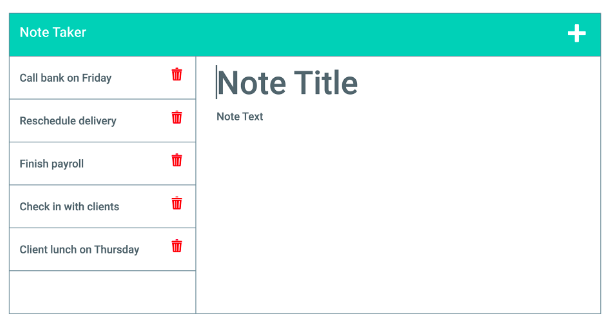
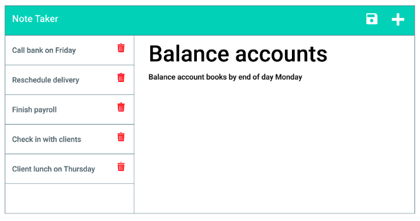
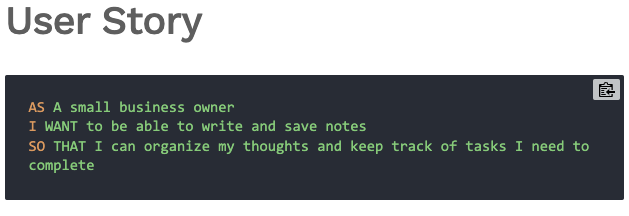
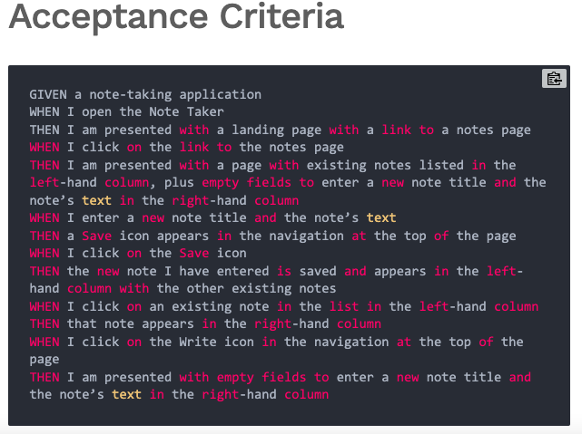

# Note-Taker-Express.js

# Table of Contents 
* [Description](#description) 
* [Installation](#installation)
* [License](#license)
* [Contributing](#contributing)
* [Questions](#questions)
        
## Description 
Your challenge is to create an application called Note Taker that can be used to write and save notes. This application will use an Express.js back end and will save and retrieve note data from a JSON file.

The application’s front end has already been created. It's your job to build the back end, connect the two, and then deploy the entire application to Heroku.

## Mock-Up

### User Story 

### Acceptance Criteria 

## Walkthrough 

## Installation
to use this application one must install express 
  npm install express

## License 

## Contributing 
William Wright was sole contributer 

## Questions
if you have any questions you can reach out to me via email at wrightw404@gmail.com 
